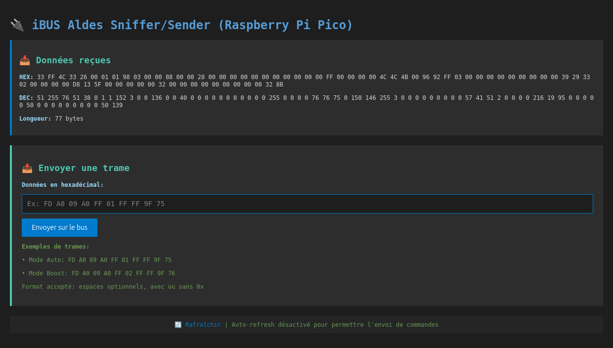

# iBUS Aldes Sniffer/Sender

Un sniffer et émetteur de trames pour le protocole iBUS utilisé par les équipements Aldes (chauffe-eau thermodynamiques T.Flow, VMC double flux InspirAIR, etc.) basé sur Raspberry Pi Pico W avec interface web.


## 🎯 Fonctionnalités

- ✅ **Capture en temps réel** des trames iBUS circulant sur le bus Aldes
- 📊 **Affichage web** des données interceptées (format hexadécimal et décimal)
- 📤 **Envoi de commandes** via formulaire web avec validation hexadécimale
- 🎨 **Interface responsive** avec thème sombre type VS Code
- 🌐 **Serveur web embarqué** accessible via WiFi
- 🔄 **Mise à jour en temps réel** des données capturées

## 📸 Aperçu



## 🔧 Matériel requis

### Composants principaux
- **Raspberry Pi Pico W** (avec WiFi intégré)
- **Bus iBUS Aldes** (disponible sur les équipements compatibles)

### Circuit d'adaptation
- Transistor NPN : **BC547** ou équivalent
- Diodes D1 et D2 1N914A
- Résistances :
  - 1x 2.2kΩ (base du transistor)
  - 1x 10kΩ (diviseur de tension RX)
  - 1x 1.2kΩ (diviseur de tension RX)
  - 1x 1kΩ (pull-up bus - optionnel si déjà présent)

## 📐 Schéma de connexion

```
Bus iBUS Aldes (24V idle)
    │
    ├──────[R1 10kΩ]───┬───── Pico GPIO1 (RX)
[D1 1N914A]            │
    │              [R2 1.2kΩ]
[D2 1N914A]            │
    │                 GND
    │
    └──[Collecteur NPN BC547]
           │
        [Base]──[R 2.2kΩ]──── Pico GPIO0 (TX inversé)
           │
        [Émetteur]──── GND

Alimentation Pico : 5V via micro-USB ou VBUS
```

### Explication du montage

**Réception (RX)** :
- Le diviseur de tension (10kΩ + 1.2kΩ) abaisse le signal 24V à ~2.5v
- Protège le GPIO1 du Pico

**Émission (TX)** :
- Le transistor NPN tire la ligne du bus à 0V (logique inversée)
- La résistance 2.2kΩ limite le courant de base
- `UART.INV_TX` compense l'inversion du transistor

## 🚀 Installation

### 1. Préparer le Raspberry Pi Pico W

```bash
# Télécharger MicroPython pour Pico W
wget https://micropython.org/download/rp2-pico-w/rp2-pico-w-latest.uf2

# Brancher le Pico en maintenant BOOTSEL enfoncé
# Copier le fichier .uf2 sur le lecteur RPI-RP2
```

### 2. Configurer le WiFi

Éditez main.py et modifiez les paramètres WiFi :

```python
ssid = 'VotreSSID'
password = 'VotreMotDePasse'
```

### 3. Uploader le code

**Via Thonny IDE** :
1. Installer [Thonny](https://thonny.org/)
2. Sélectionner "MicroPython (Raspberry Pi Pico)" dans les options
3. Ouvrir main.py et cliquer sur "Enregistrer sur Raspberry Pi Pico"

**Via ampy** :
```bash
pip install adafruit-ampy
ampy --port /dev/ttyACM0 put main.py
```

**Via rshell** :
```bash
pip install rshell
rshell --port /dev/ttyACM0
> cp main.py /pyboard/
```

### 4. Connecter le circuit

> ⚠️ **Attention** Bien repérer le GND et le signal du bus en utilisant par exemple un multimètre, car le montage n'est pas protégé pour les inversions!

Réalisez le montage selon le schéma ci-dessus et connectez aux bornes iBUS de votre équipement Aldes.

### 5. Démarrer

1. Alimenter le Pico via USB
2. Ouvrir la console série (115200 baud) pour voir l'adresse IP
3. Accéder à l'interface web : `http://<IP_affichée>`

## 💻 Utilisation

### Interface web

Accédez à l'interface via votre navigateur :
```
http://192.168.x.x
```
(Remplacez par l'IP affichée dans la console série)

### Capture de trames

Les données reçues du bus s'affichent automatiquement dans la section **"📥 Données reçues"**.

### Envoi de commandes

1. Entrez une trame hexadécimale dans le champ de saisie
2. Formats acceptés :
   - Avec espaces : `FD A0 09 A0 FF 01 FF FF 9F 75`
   - Sans espaces : `FDA009A0FF01FFFF9F75`
   - Avec préfixe : `0xFD 0xA0 0x09...`
3. Cliquez sur **"Envoyer sur le bus"**
4. Un message de confirmation s'affiche

### Exemples de trames

```
FD A0 09 A0 FF 01 FF FF 9F 75    // Mode automatique
FD A0 09 A0 FF 02 FF FF 9F 76    // Mode boost
```

> ⚠️ **Attention** : Ces exemples sont donnés à titre indicatif. Capturez d'abord les trames réelles de votre installation avant d'envoyer des commandes.

## 📡 Protocole iBUS Aldes

### Caractéristiques techniques

| Paramètre | Valeur |
|-----------|--------|
| **Vitesse** | 2400 baud |
| **Format** | 8 bits, no parity, 1 stop bit (8N1) |
| **Signal** | Logique inversée (idle=24V, actif=0V) |
| **Topologie** | Bus multi-maître (similaire eBUS) |
| **Longueur** | Variable selon la commande |

### Structure de trame (supposée)

```
[START] [ADDR] [CMD] [DATA...] [CHECKSUM] [END]
│       │      │     │          │          └─ Octet de fin
│       │      │     │          └──────────── CRC/Checksum
│       │      │     └─────────────────────── Données (0-N bytes)
│       │      └───────────────────────────── Commande
│       └──────────────────────────────────── Adresse destination
└──────────────────────────────────────────── Octet de début (0xFD)
```

> 📝 **Note** : Le protocole exact n'est pas documenté publiquement par Aldes. Les structures ci-dessus sont basées sur l'observation et la similarité avec le protocole eBUS.

## 🛠️ Configuration technique

### Paramètres UART

```python
uart0 = UART(0, 
    baudrate=2400,      # Vitesse du bus iBUS
    bits=8,             # 8 bits de données
    parity=0,           # Pas de parité
    stop=1,             # 1 bit de stop
    tx=Pin(0),          # GPIO0 pour TX
    rx=Pin(1),          # GPIO1 pour RX
    invert=UART.INV_TX  # Inversion TX pour compenser le transistor
)
```

### Réseau WiFi

- Mode : **Station (STA)**
- Connexion automatique au démarrage
- Redémarrage si échec de connexion (après 10 secondes)
- Serveur web sur port **80**

## 🔒 Sécurité et avertissements

### ⚠️ Avertissements importants

- Ce projet interagit directement avec votre installation Aldes
- **Testez d'abord en mode lecture seule** (sniffer uniquement)
- Vérifiez les trames capturées avant d'envoyer des commandes
- **Utilisez à vos risques et périls**
- L'auteur décline toute responsabilité en cas de dommage

### 🔐 Sécurité réseau

- Le serveur web n'a **pas d'authentification**
- Accessible à tous les appareils du réseau local
- Ne pas exposer sur Internet sans protection
- Envisager d'ajouter un mot de passe si nécessaire

### ⚡ Sécurité électrique

- Respecter les tensions (24V bus, 3.3V GPIO)
- Vérifier le montage avant mise sous tension
- Isoler correctement les connexions
- Ne pas court-circuiter le bus iBUS

## 📚 Ressources

### Documentation
- [Protocole eBUS](https://github.com/john30/ebusd/wiki/Protocol) - Similaire à iBUS Aldes
- [MicroPython UART](https://docs.micropython.org/en/latest/library/machine.UART.html) - Documentation officielle
- [Raspberry Pi Pico W](https://www.raspberrypi.com/documentation/microcontrollers/raspberry-pi-pico.html) - Datasheet et pinout

### Communauté
- [Forum Aldes](https://www.aldes.fr/support) - Support officiel Aldes
- [MicroPython Forum](https://forum.micropython.org/) - Aide MicroPython

### Outils
- [Thonny IDE](https://thonny.org/) - IDE Python pour débutants
- [ampy](https://github.com/scientifichackers/ampy) - Outil CLI pour transfert de fichiers
- [rshell](https://github.com/dhylands/rshell) - Shell pour MicroPython

## 📄 Licence

Ce projet est sous licence **MIT** - voir le fichier LICENSE pour plus de détails.

```
Copyright (c) 2024 Yann Doublet

Permission is hereby granted, free of charge, to any person obtaining a copy
of this software and associated documentation files (the "Software"), to deal
in the Software without restriction, including without limitation the rights
to use, copy, modify, merge, publish, distribute, sublicense, and/or sell
copies of the Software...
```

## 📧 Contact

**Yann Doublet**

Pour toute question ou suggestion, n'hésitez pas à ouvrir une issue sur GitHub.

---

⭐ Si ce projet vous a été utile, n'hésitez pas à lui donner une étoile !

**Version** : 1.0.0  
**Dernière mise à jour** : Octobre 2024
